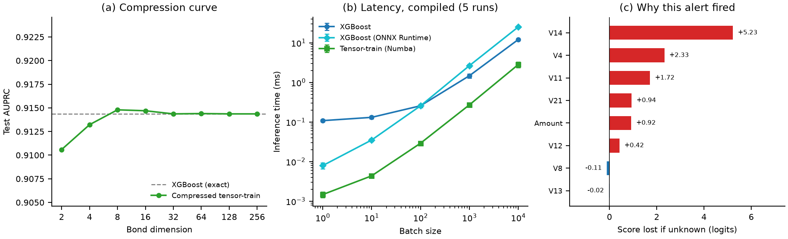

# Exact tensor-network distillation for explainable card-fraud detection

This repository backs Quantum Mads' Phase 1 proposal for the HSBC problem statement
of the **2026 Global Quantum + AI Challenge**. It holds the code, result tables and
tests behind every result in the proposal, all run on the public European
Cardholder (ULB) fraud dataset.

## The idea

Banks score card fraud with ensembles of decision trees such as XGBoost. We found
that a trained tree ensemble can be rewritten **exactly** as a tensor network, a
compact structure from quantum physics. Nothing is retrained or approximated, so the
bank keeps the model it has already validated. The tensor network can then be
compressed and used in three ways:

- **to score transactions faster** than the original model;
- **to handle missing fields** exactly, by averaging over the values they could take;
- **to explain every decision** exactly: what each feature contributed and how close
  the decision came to the threshold.



*(a) Compression keeps XGBoost's accuracy. (b) The compressed network scores faster at
every batch size. (c) The explanation an analyst receives for one fraud alert.*

## What we found

All results use 8 features of the ULB data (one explanation test uses all 29).

- **Same accuracy.** Compressed to bond dimension 4, the network already matches
  XGBoost (AUPRC 0.913 against 0.914).
- **Faster scoring.** 4.3 to 8.8 times faster than the best-optimised XGBoost at every
  batch size, with both models compiled and running on one processor core.
- **More robust to missing fields.** Higher AUPRC than XGBoost's built-in handling at
  every missing rate from 10% to 50% (+0.03 to +0.16). With the same review capacity
  (98 alerts), it catches 4 to 18 more of the 98 test frauds.
- **Exact, repeatable explanations.** Explaining 20 transactions takes 3 ms, against
  26 ms for XGBoost's TreeSHAP. Sampling-based KernelSHAP gives different answers from
  run to run: 6% apart with 8 features, 47% with 29.
- **Scales in stages.** Converting groups of trees and merging them gives the same
  accuracy as a one-step conversion with 28 times less memory for the tensors.

## Check it yourself

No dataset is needed for this:

```bash
uv sync
uv run pytest tests/                    # 20 exactness tests, a few minutes
uv run python scripts/make_figures.py   # redraws the figure above from the committed tables
```

## Where each result comes from

Each result has one script, one committed table in `results/tables/` and, where the
claim is about exactness, one test. The maths is written out in
[docs/MATH.md](docs/MATH.md).

| Result | In the proposal | Script | Result table | Test |
|---|---|---|---|---|
| Exact conversion and compression | Figure 2(a), Section 2, Appendix 1 | `01_distillation_compression.py` | `distillation_compression.json` | `test_tree_to_tt.py` |
| Faster scoring | Figure 2(b), Table A1 | `12_compiled_latency.py` | `latency_compiled.json` | `test_fast_contraction.py` |
| Fine-tuning after conversion | Section 2, Appendix 1 | `10_tt_finetune.py` | `tt_finetune_lr0.0002_steps1500_seed{0,1,2}.json` | `test_tt_finetune.py` |
| Explanation speed and repeatability | Section 2, Table A2 | `03_attribution_benchmark.py`, `09_attribution_full_scale.py` | `attribution_benchmark.json`, `attribution_full_scale.json` | `test_attribution.py` |
| Missing fields: accuracy | Section 2, Table A2 | `04_missing_fields.py` | `missing_fields.json` | `test_tree_to_tt.py` |
| Missing fields: frauds caught with the same review capacity | Section 2, Section 4, Appendix 1 | `15_missing_fields_operational.py` | `missing_fields_operational.json` | — |
| The explanation of one alert | Figure 2(c), Appendix 1 | `16_explanation_example.py` | `explanation_example.json` | — |
| How close decisions are to the threshold | Section 2, Appendix 1 | `05_boundary_sensitivity.py` | `boundary_sensitivity.json` | `test_boundary_sensitivity.py` |
| What the model relies on (entanglement entropy) | Section 2, Table A3 | `06_entropy_calibration.py` | `entropy_calibration.json` | `test_stack_entropy.py` |
| Converting in stages | Section 3 | `11_hierarchical_merge.py` | `hierarchical_merge.json` | `test_hierarchical_merge.py` |
| Confidence intervals | Appendix 1, Table A2 | `14_bootstrap_intervals.py` | `bootstrap_intervals.json` | — |

## Reproduce from scratch

Download `creditcard.csv` from
[Kaggle](https://www.kaggle.com/datasets/mlg-ulb/creditcardfraud) into `data/raw/`, then:

```bash
uv sync
uv run python scripts/00_prepare_data.py
uv run python scripts/01_distillation_compression.py   # about 1 min
uv run python scripts/03_attribution_benchmark.py      # about 3 min
uv run python scripts/04_missing_fields.py             # needs about 7 GB of RAM
uv run python scripts/05_boundary_sensitivity.py
uv run python scripts/06_entropy_calibration.py
uv run python scripts/09_attribution_full_scale.py     # about 20 min
uv run python scripts/10_tt_finetune.py                # about 5 min
uv run python scripts/11_hierarchical_merge.py         # about 6 min
uv run python scripts/12_compiled_latency.py           # about 6 min
uv run python scripts/14_bootstrap_intervals.py        # about 4 min (run 01 and 04 first)
uv run python scripts/15_missing_fields_operational.py # about 1 min (run 04 first)
uv run python scripts/16_explanation_example.py        # about 2 min
uv run python scripts/make_figures.py
```

Each script writes its table to `results/tables/`. Seeds are fixed, and each script's
docstring states the sample it uses. (`02_latency_benchmark.py` is an earlier,
uncompiled speed test kept for reference.)

## Repository layout

```
src/qdistill/     the method: conversion, compression, staged conversion, fast scoring,
                  explanations, missing fields, boundary sensitivity, entropy
scripts/          one script per result, plus make_figures.py
results/tables/   the committed result tables behind every number
tests/            exactness tests
docs/MATH.md      the maths behind each step
```

## Limits

- **Scale.** Every result uses 8 features. Converting a full 29-feature model in one
  step would need an estimated 550 GB of memory. Converting in stages works on a
  2,052-leaf model, and applying it at full size is the next phase of work.
- **Small test set.** The main test sample has 20 frauds, so absolute AUPRC is uncertain
  (XGBoost's 95% interval is 0.79 to 1.00). Comparisons on the same transactions are
  much tighter.
- **Speed** is measured on compact models and one core; it has to be re-checked at
  production feature counts.
- **Other tree models.** This repository converts XGBoost. The Random Forest and
  CatBoost converters are in a private repository, available on request.

## Data

European Cardholder dataset: A. Dal Pozzolo, O. Caelen, R. A. Johnson and
G. Bontempi, "Calibrating probability with undersampling for unbalanced
classification," IEEE SSCI 2015. The dataset is published under the Open Database
License and is not redistributed here.
